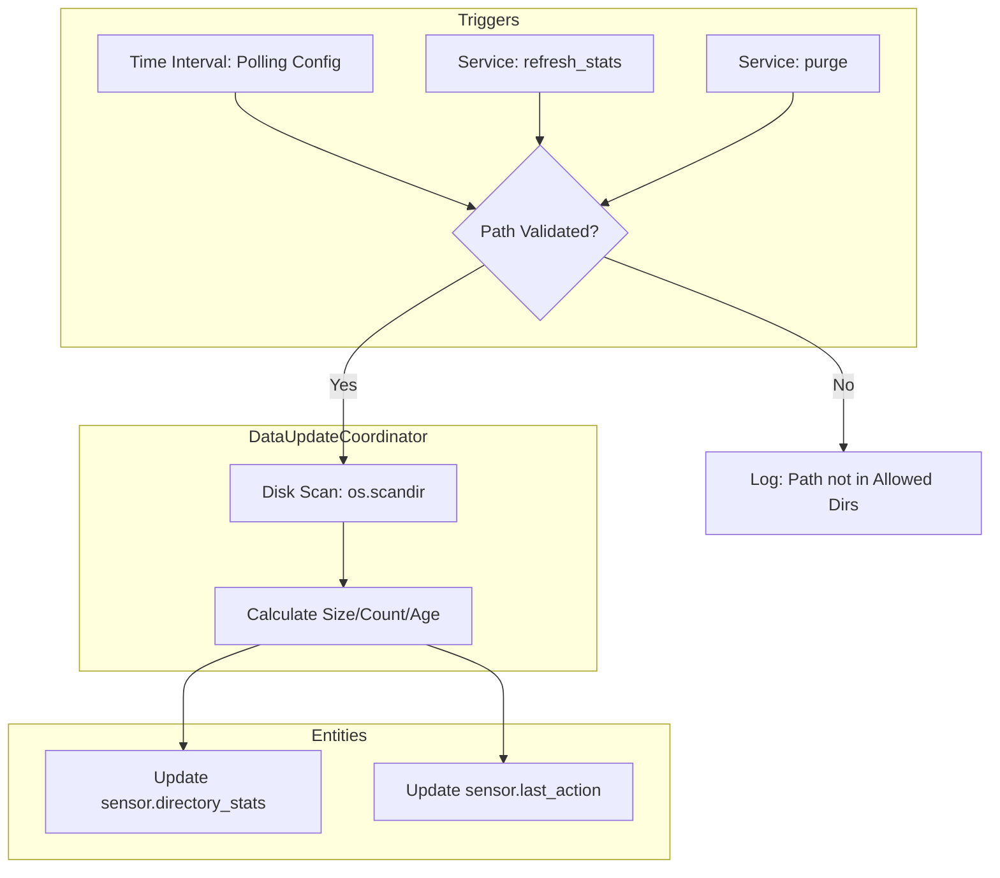

This is a smart addition. Giving users control over the **Polling Interval** prevents unnecessary disk wear on SD cards (common in Raspberry Pi setups), while the **Manual Poll Service** allows for precise control within automations.
Here is the final, comprehensive **Markdown Specification**.
# Specification: File Purge Manager (Integration)
## 1. Overview
The **File Purge Manager** is a native Home Assistant integration for managing local file storage. It provides a service to filter and delete files, alongside sensors that monitor directory health. It features a dual-layer security model, customizable background polling, and an on-demand refresh mechanism.
## 2. Security & Configuration (UI Flow)
When adding the integration, the user configures the following via the **Options Flow**:
 * **Allowed Directories:** A list of absolute paths (e.g., /media/snapshots) where the integration is permitted to operate.
 * **Polling Interval:** A slider or input (in minutes) to define how often sensors refresh (Default: 30, Range: 1-1440).
 * **Enable Manual Service:** Toggle to enable/disable the file_manager.refresh_stats service.
## 3. Entities & State
### A. Directory Monitor (sensor.<dir_name>_stats)
 * **State:** Total directory size.
 * **Attributes:** file_count, oldest_file_timestamp, path.
 * **Update Frequency:** Defined by **Polling Interval** OR immediately following a purge or refresh_stats service call.
### B. Last Action Tracker (sensor.file_manager_last_action)
 * **State:** Timestamp of last activity.
 * **Attributes:** files_processed, last_run_type (Dry/Live), dirs_removed.
## 4. Services
### Service A: file_manager.purge
The primary cleanup tool.
 * **Fields:** path, filename_filter, age_days, dry_run, recursive, remove_empty_dirs.
 * **Behavior:** Identifies/Deletes files and **immediately** triggers a refresh of the sensors.
### Service B: file_manager.refresh_stats
A manual trigger to update sensors without deleting any files.
 * **Fields:** path (Optional: If empty, refreshes all allowed directories).
 * **Use Case:** Use this in an automation after a camera records a high-volume event to get updated disk usage stats immediately.
## 5. Technical Architecture (Logic Flow)

## 6. Implementation Requirements
### A. I/O Management
 * **Async/Thread Safety:** All disk I/O (os.scandir, os.remove, os.path.getsize) **must** be executed in the thread pool using hass.async_add_executor_job.
 * **Coordinator:** Use the DataUpdateCoordinator to manage the polling interval. This ensures that if multiple sensors exist, the disk is only scanned once per cycle.
### B. Empty Directory Cleanup (Bottom-Up)
To safely remove empty folders:
 1. Perform the file purge.
 2. If remove_empty_dirs is true, use os.walk(topdown=False).
 3. Attempt os.rmdir(dir). If the directory is truly empty, it succeeds. If a new file was created during the process, it fails gracefully without stopping the service.
### C. Example Automation: Manual Refresh
```yaml
alias: "Update Stats After Backup"
description: "Refresh sensors after the nightly backup completes"
trigger:
  - platform: event
    event_type: "backup_completed"
action:
  - service: file_manager.refresh_stats
    data:
      path: "/backup"

```
### Final Spec Summary
| Feature | Implementation |
|---|---|
| **Filename Filter** | Glob patterns (*.jpg, cam_1_*) |
| **Selection Logic** | Age-based (T_{mtime}) |
| **Security** | Integration-specific Allowlist + HA global allowlist |
| **Polling** | User-configurable (minutes) via Options Flow |
| **Outputs** | response_variable (files list) + UI Sensors |
