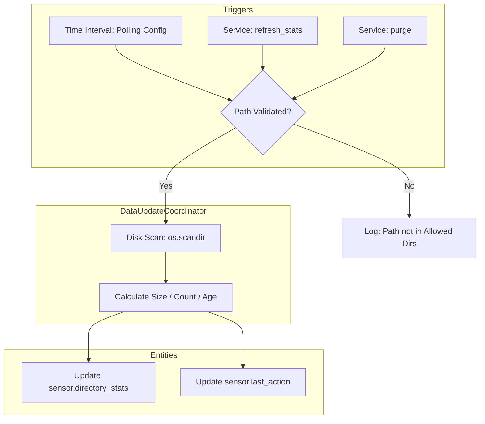

# 🗂️ HA Retention Manager

> A native Home Assistant integration for intelligent local file storage management.

[](https://www.home-assistant.io/)
[](LICENSE)
[](https://hacs.xyz/)

---

## Overview

**HA Retention Manager** (File Purge Manager) is a custom Home Assistant integration that gives you full control over local file storage. Whether you're cleaning up old camera snapshots, managing backup archives, or keeping an eye on disk health — this integration handles it automatically, safely, and on your schedule.

It features:
- 🔒 **Dual-layer security** via an integration-specific directory allowlist
- 📊 **Live disk-health sensors** per monitored directory
- 🧹 **Flexible purge service** with glob filters, age thresholds, and dry-run support
- ⏱️ **Configurable polling interval** to protect SD cards and low-power hardware
- 🔔 **On-demand refresh** for use inside automations

---

## Features

| Feature | Detail |
|---|---|
| **Filename Filter** | Glob patterns — e.g. `*.jpg`, `cam_1_*` |
| **Selection Logic** | Age-based deletion using `mtime` |
| **Security** | Integration allowlist + HA global `allowlist_external_dirs` |
| **Polling** | User-configurable (1 – 1440 min) via Options Flow |
| **Outputs** | `response_variable` file list + live UI sensors |
| **Empty Dir Cleanup** | Bottom-up `os.rmdir` — safe, non-destructive |

---

## Installation

### Via HACS (Recommended)

1. Open **HACS** → **Integrations** → ⋮ menu → **Custom repositories**
2. Add this repository URL and select category **Integration**
3. Click **Download** on the **HA Retention Manager** card
4. Restart Home Assistant

### Manual

1. Copy the `custom_components/retention_manager/` folder into your HA `config/custom_components/` directory
2. Restart Home Assistant

For a step-by-step setup and test workflow, see [quickstart.md](quickstart.md).

---

## Configuration

Add the integration via **Settings → Devices & Services → Add Integration → File Purge Manager**.

During setup (and later via **Options**), you configure:

| Option | Description | Default |
|---|---|---|
| **Allowed Directories** | Absolute paths the integration may operate in (e.g. `/media/snapshots`) | _(required)_ |
| **Polling Interval** | How often directory sensors refresh (minutes) | `30` |
| **Enable Manual Service** | Toggle the `file_manager.refresh_stats` service on/off | `true` |

> **Security note:** The integration will refuse to act on any path not present in your Allowed Directories list. This protects critical system directories from accidental deletion.

---

## Entities

### `sensor.<dir_name>_stats` — Directory Monitor

Tracks health for each configured directory.

| | |
|---|---|
| **State** | Total directory size (bytes) |
| **`file_count`** | Number of files in the directory |
| **`oldest_file_timestamp`** | Timestamp of the oldest file |
| **`path`** | Absolute path being monitored |

Updates on every polling cycle, and **immediately** after a purge or `refresh_stats` call.

---

### `sensor.file_manager_last_action` — Last Action Tracker

Tracks the most recent integration activity.

| | |
|---|---|
| **State** | Timestamp of last activity |
| **`files_processed`** | Number of files affected |
| **`last_run_type`** | `Dry` or `Live` |
| **`dirs_removed`** | Number of empty directories removed |

---

## Services

### `file_manager.purge`

The primary cleanup tool. Identifies and optionally deletes files matching your criteria, then immediately refreshes sensors.

```yaml
service: file_manager.purge
data:
  path: "/media/snapshots"
  filename_filter: "cam_1_*.jpg"
  age_days: 30
  dry_run: true          # Preview what would be deleted — no files are removed
  recursive: true        # Scan subdirectories
  remove_empty_dirs: true  # Remove empty folders after purge (bottom-up)
```

| Field | Type | Description |
|---|---|---|
| `path` | string | Target directory (must be in Allowed Directories) |
| `filename_filter` | string | Glob pattern to match filenames |
| `age_days` | int | Delete files older than this many days |
| `dry_run` | bool | If `true`, logs matches without deleting |
| `recursive` | bool | Whether to scan subdirectories |
| `remove_empty_dirs` | bool | Remove empty subdirectories after purge |

---

### `file_manager.refresh_stats`

Manually triggers a sensor refresh without deleting anything.

```yaml
service: file_manager.refresh_stats
data:
  path: "/backup"   # Optional — omit to refresh ALL allowed directories
```

---

## Example Automations

### Nightly Cleanup of Old Snapshots

```yaml
alias: "Nightly Snapshot Cleanup"
description: "Delete camera snapshots older than 14 days every night at 2am"
trigger:
  - platform: time
    at: "02:00:00"
action:
  - service: file_manager.purge
    data:
      path: "/media/snapshots"
      filename_filter: "*.jpg"
      age_days: 14
      dry_run: false
      recursive: true
      remove_empty_dirs: true
```

### Refresh Stats After a Backup Completes

```yaml
alias: "Update Stats After Backup"
description: "Refresh sensors after the nightly backup completes"
trigger:
  - platform: event
    event_type: "backup_completed"
action:
  - service: file_manager.refresh_stats
    data:
      path: "/backup"
```

---

## Architecture



All disk I/O (`os.scandir`, `os.remove`, `os.path.getsize`) is executed via `hass.async_add_executor_job` to keep the event loop non-blocking. A single `DataUpdateCoordinator` ensures only one disk scan occurs per polling cycle regardless of how many directory sensors are active.

---

## Requirements

- Home Assistant **2024.1** or later
- Python **3.11+** (bundled with HA)

---

## Contributing

Pull requests are welcome! Please open an issue first to discuss what you'd like to change.

---

## License

[MIT](LICENSE)
