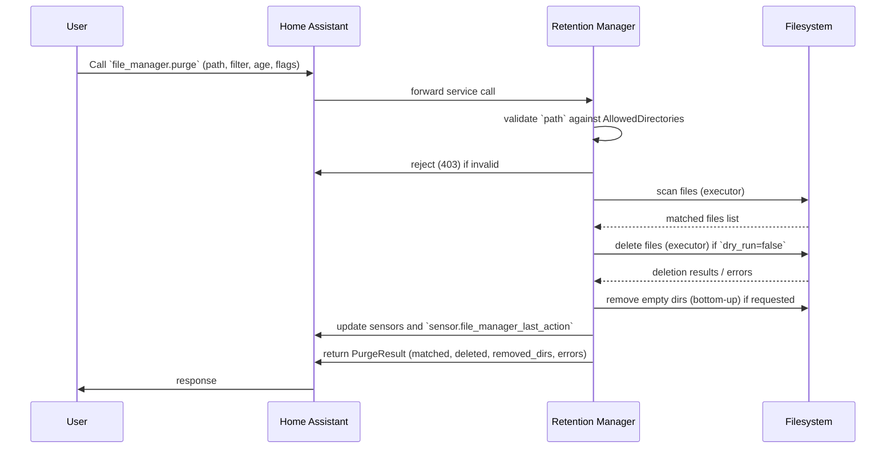
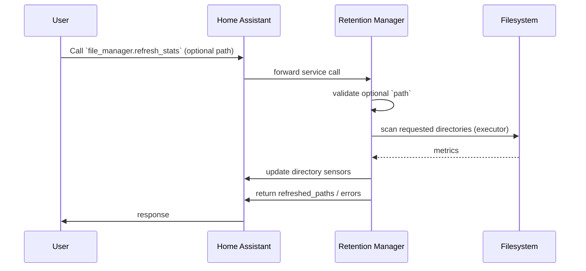

# Sequence Diagrams — File Purge Manager

## Purge Service Flow

```mermaid
sequenceDiagram
    participant User
    participant HA as Home Assistant
    participant Integration as Retention Manager
    participant Disk as Filesystem

    User->>HA: Call `file_manager.purge` (path, filter, age, flags)
    HA->>Integration: forward service call
    Integration->>Integration: validate `path` against AllowedDirectories
    Integration->>HA: reject (403) if invalid
    Integration->>Disk: scan files (executor)
    Disk-->>Integration: matched files list
    Integration->>Disk: delete files (executor) if `dry_run=false`
    Disk-->>Integration: deletion results / errors
    Integration->>Disk: remove empty dirs (bottom-up) if requested
    Integration->>HA: update sensors and `sensor.file_manager_last_action`
    Integration->>HA: return PurgeResult (matched, deleted, removed_dirs, errors)
    HA->>User: response
```

## Refresh Stats Flow

```mermaid
sequenceDiagram
    participant User
    participant HA as Home Assistant
    participant Integration as Retention Manager
    participant Disk as Filesystem

    User->>HA: Call `file_manager.refresh_stats` (optional path)
    HA->>Integration: forward service call
    Integration->>Integration: validate optional `path`
    Integration->>Disk: scan requested directories (executor)
    Disk-->>Integration: metrics
    Integration->>HA: update directory sensors
    Integration->>HA: return refreshed_paths / errors
    HA->>User: response
```
